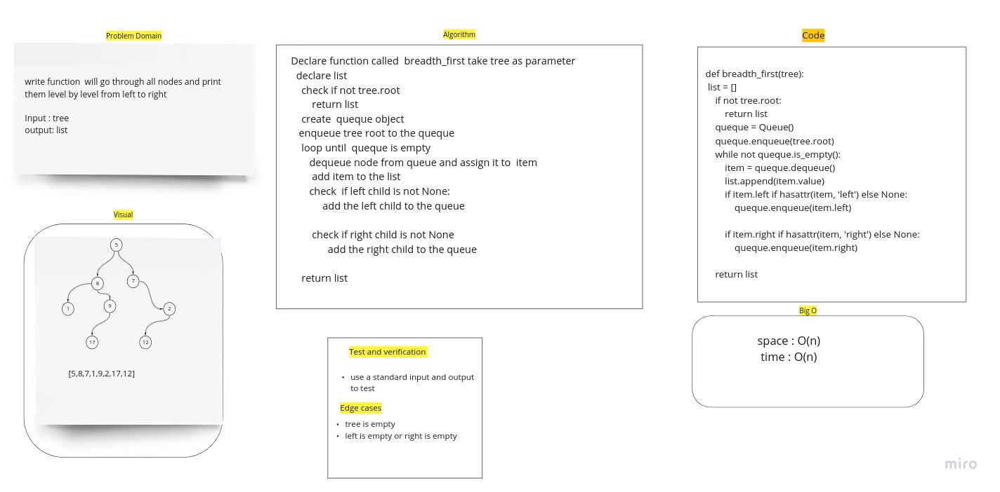
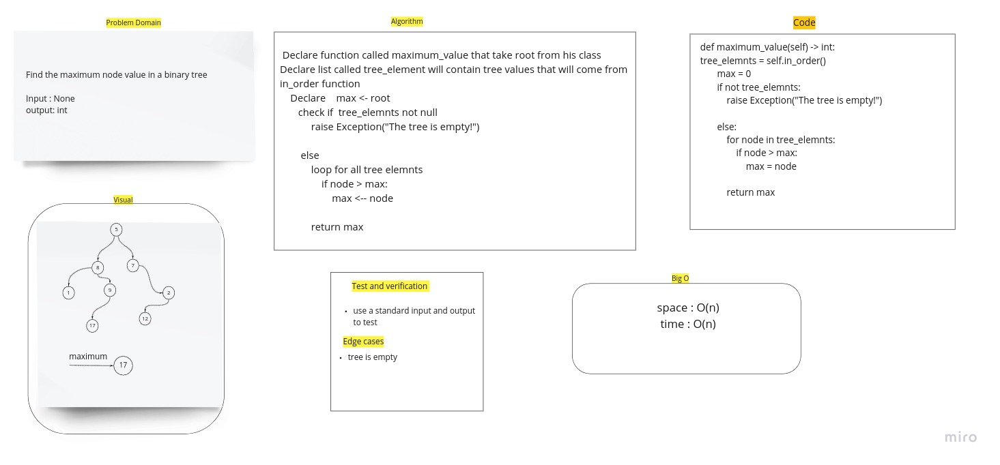
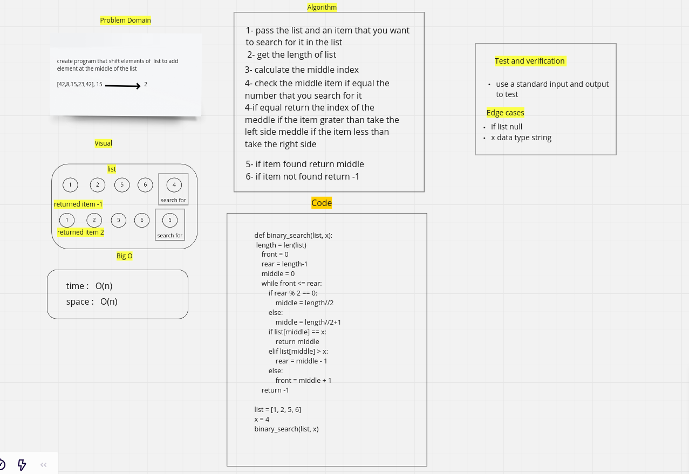

# Codechallenge17

## Challenge Summary

    -   Print tree elements breadth first

## Whiteboard Process

## Approach & Efficiency

This to find the best way for the compiler to excution to search for element in list.
time: O(n) space: O(n)

## Solution

this function will go through all nodes and print them level by level from left to right

================================================================================================================================

## Codechallenge16

## Challenge Summary

    -   Find the maximum node value in a binary tree

## Whiteboard Process

## Approach & Efficiency

This to find the best way for the compiler to excution to search for element in list.
time: O(n) space: O(n)

## Solution

this finction will go through all nodes and finde maximum

================================================================================================================================

## codechllenge15

## Insert to Middle of an Array:

this program use binary search algorithem to serch inside list for element.

## Whiteboard Process

## Approach & Efficiency

This to find the best way for the compiler to excution to search for element in list.
time: O(n) space: O(n)

## API

-   binary search tree

    -   add: to add new node to BST and put it according to its value
    -   contains: check if the item exist in tree

-   binary tree

    -   pre_order : to print the element by orderin root->left->right
    -   in_order : to print the element by orderin left->root->right
    -   post_order : to print the element by orderin left->right->root
