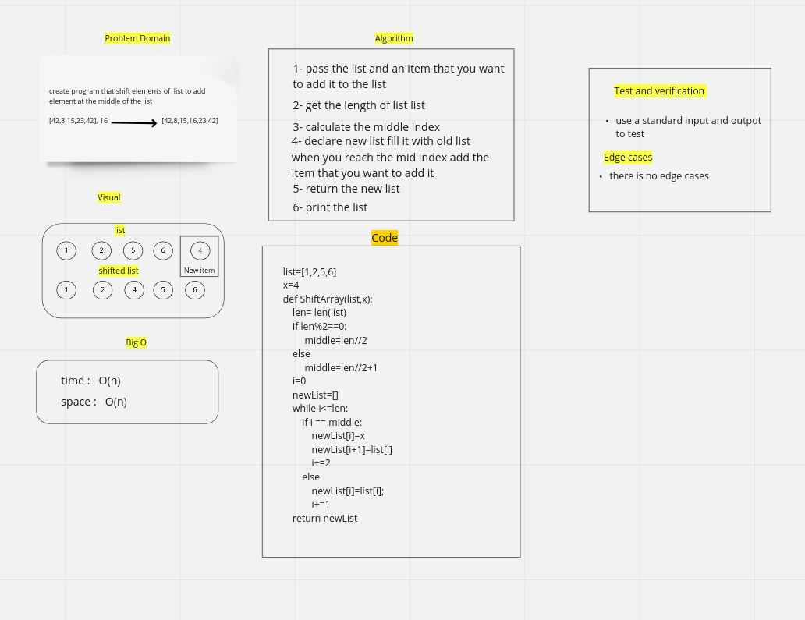

# Insert to Middle of an Array:

this program to shift the elements of list to insert new element at the middle of an list.

## Whiteboard Process

## Approach & Efficiency

This to find the best way for the compiler to excution to insert value at the middle of list.
