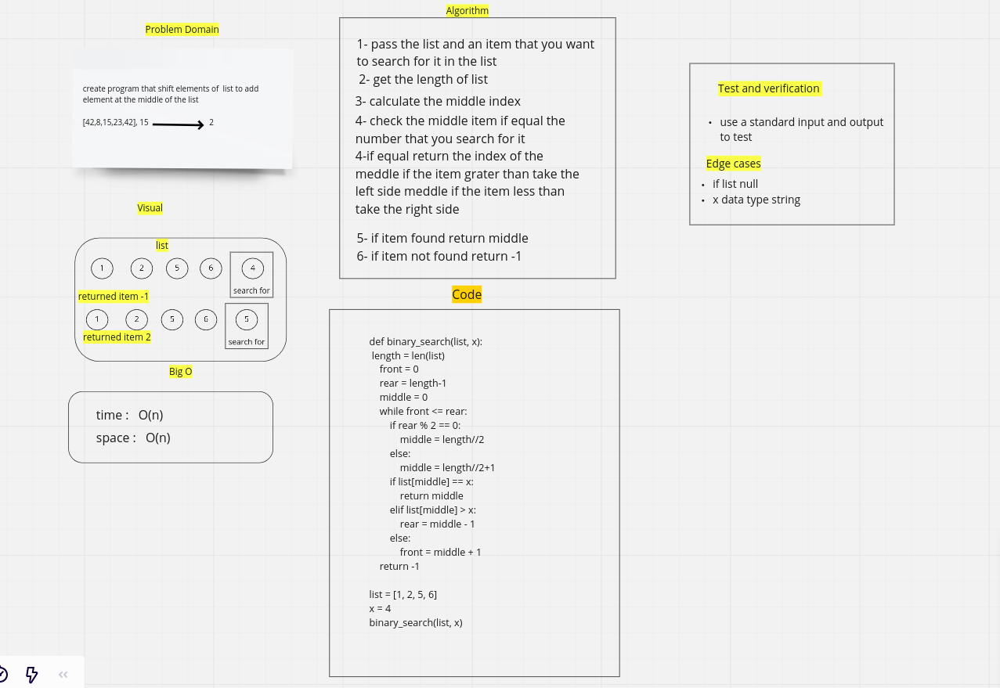

# Insert to Middle of an Array:

this program use binary search algorithem to serch inside list for element.

## Whiteboard Process

## Approach & Efficiency

This to find the best way for the compiler to excution to search for element in list.
