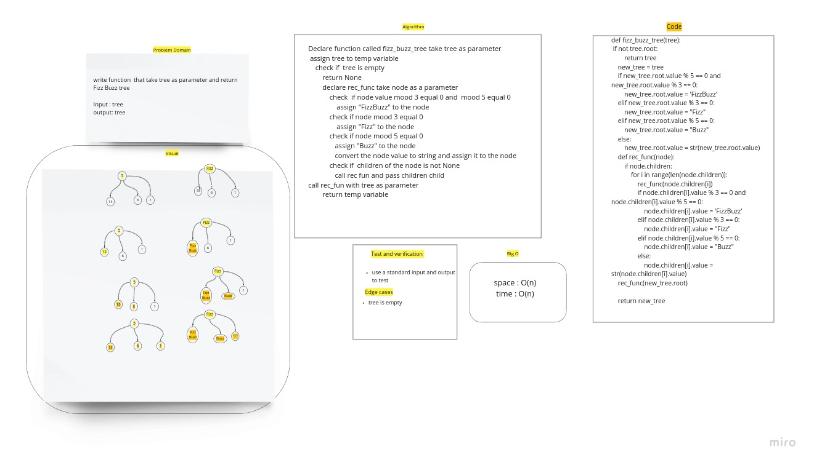

# Challenge Summary

Fizz buzz tree challenge this function recive tree as parameter and return fizz buzz tree.

## Whiteboard Process

## Approach & Efficiency

This to find the best way for the compiler to excution to search for element in list.
time: O(n) space: O(n)

## Solution

for this challenge will make coppy of the input tree and go through the all nodes and check if the node value divisible by 3 replace it with "Fizz", if the node value divisible by 5 replace it with "Buzz",
if the node value divisible by 3 and 5 replace it with "FizzBuzz" other ways convert the node value to string
