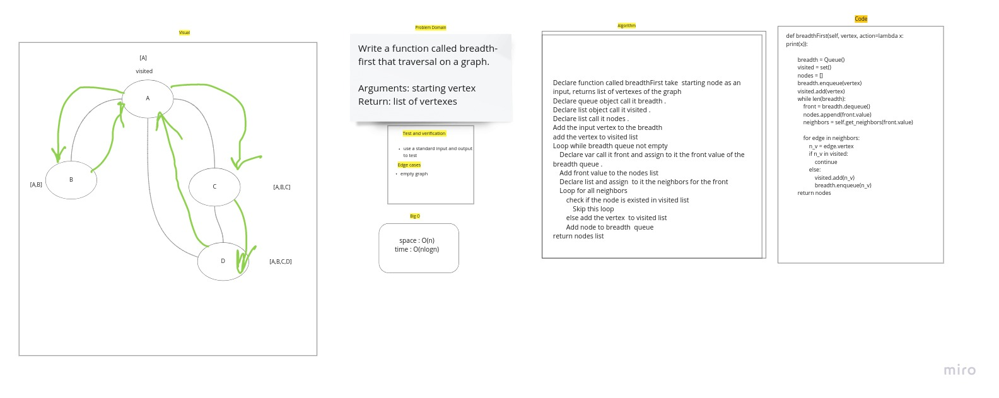

# Code Challenge 38

## Challenge Summary

Write the following method for the Graph class:
depth first
Arguments: Node (Starting point of search)
Return: A collection of nodes in their pre-order depth-first traversal order

## Whiteboard Process

## Approach & Efficiency

time : O(nlogn)
space : O(n)

## Solution

use the example below the code to make run the code by click F5

## Code challenge 36

## Graphs

A graph is a non-linear data structure that can be looked at as a collection of vertices (or nodes) potentially connected by line segments named edges.

## Challenge

Implement your own Graph. The graph should be represented as an adjacency list, and should include the following methods:

    - breadthFirst
    - add node
    - add edge
    - get nodes
    - get neighbors
    - size

## Whiteboard Process

## Approach & Efficiency

    - breadthFirst time : O(nlogn) space : O(n)
    - add node: time:O(1) space:O(1)
    - add edge: time:O(1) space:O(1)
    - get nodes: time:O(n) space:O(1)
    - get neighbors: time:O(n) space:O(1)
    - size time:O(n) space:O(1)

## API

### add node

    Arguments: value
    Returns: The added node
    Add a node to the graph

### add edge

    Arguments: 2 nodes to be connected by the edge, weight (optional)
    Returns: nothing
    Adds a new edge between two nodes in the graph
    If specified, assign a weight to the edge
    Both nodes should already be in the Graph

### get nodes

    Arguments: none
    Returns all of the nodes in the graph as a collection (set, list, or similar)
    get neighbors
    Arguments: node
    Returns a collection of edges connected to the given node
    Include the weight of the connection in the returned collection

### size

    Arguments: none
    Returns the total number of nodes in the graph
