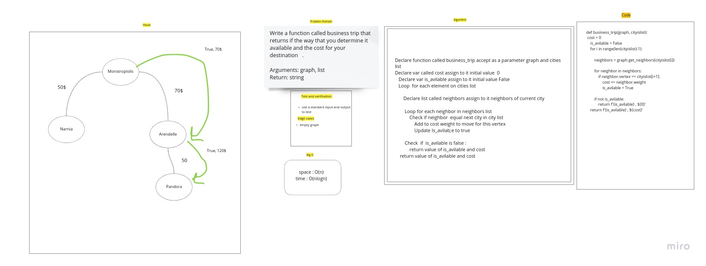

# Challenge Summary

Write a function called business trip Determine whether the trip is possible with direct flights, and how much it would cost.

## Whiteboard Process

## Approach & Efficiency

Space: O(n)
time: O(nlogn)

## Solution

<!-- Show how to run your code, and examples of it in action -->
