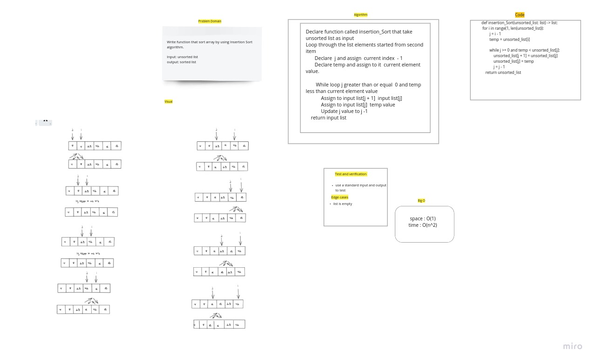

# Challenge Summary

write a function take a unsorted list and return sorted list

## Whiteboard Process

## Approach & Efficiency

space : O(1)
time : O(n^2)

## Solution

divide the list to sorted list and unsorted list and compare the first element with all element of sorted list and put it in correct position.
