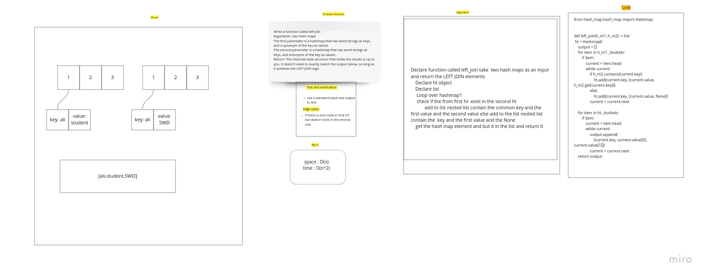

# Hashmap LEFT JOIN

    by this code challenge we should be able to get the left join relation between two Hash Table

## Challenge

this function called left join
Arguments: two hash maps
The first parameter is a hashmap that has word strings as keys, and a synonym of the key as values.
The second parameter is a hashmap that has word strings as keys, and antonyms of the key as values.
Return: The returned data structure that holds the results is up to you. It doesn’t need to exactly match the output below, so long as it achieves the LEFT JOIN logic

## Approach & Efficiency

space : O(n)
time : O(n^2)

## Solution

