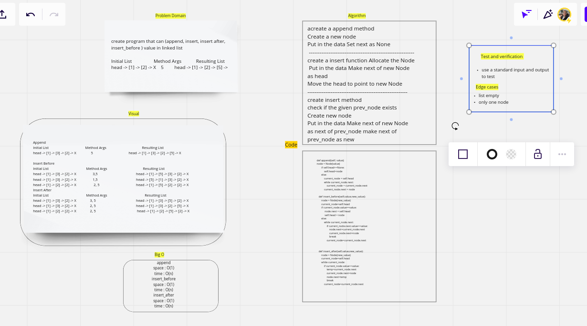
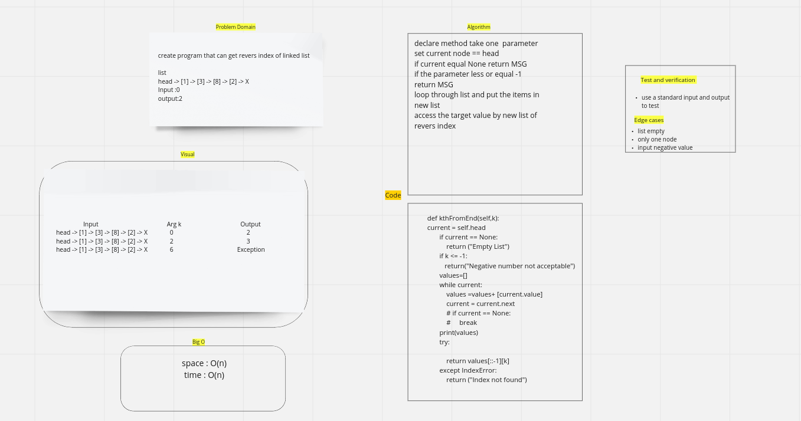
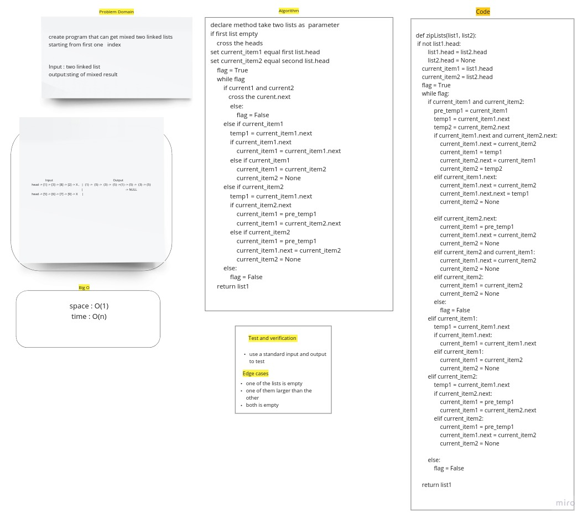

# Singly Linked List

this App you can add value to linked list and search if item inside it and get all linked list values , append item, insert befor, insert after, kthFromEnd

linked list zip : that give cross two linked list

## Whiteboard Process

## codechallenge06

## codechallenge07

## codechallenge08

## Challenge

everything running smoothly

## Approach & Efficiency

append
space : O(1)
time : O(n)

insert_before
space : O(1)
time : O(n)

insert_after
space : O(1)
time : O(n)

kthFromEnd
space : O(n)
time : O(n)

kthFromEnd
space : O(1)
time : O(n)

## API

insert : add item to first of linked list
append : add item to rear of linked list
insert after: add item after specific item
insert befor: add item befor specific item
incloud: check if value exested in linked list
kthFromEnd: get the value reversd index of linked list
linked_list_zip: give cross two linked list
