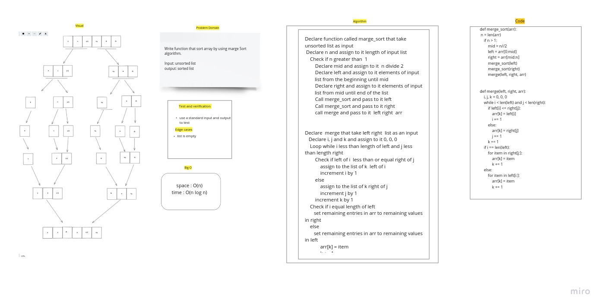

# Challenge Summary

write a function take a unsorted list and return sorted list by using marge sort algorithm

## Whiteboard Process

## Approach & Efficiency

space : O(n)
time : O(nlogn)

## Solution

divide the list to left list and right list until i get one element of left and on of right and atart compare and marge the elements.
