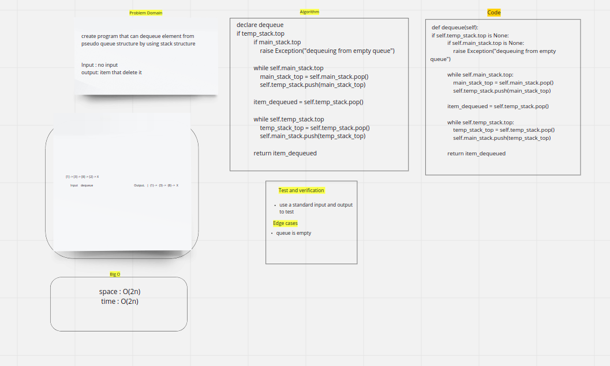

# Challenge Summary

by pseudo_queue you can enqueue and dequeue using two stacks

## Whiteboard Process

## codechallenge07

## Approach & Efficiency

enqueue:
space: O(1)
time: O(1)

dequeue:
space: O(n)
time: O(2n)

## Solution

when enqueue push item to main_stack
when dequeue move items from main stack to temp stack -> pop from temp stack -> move elements from temp stack to main stack
