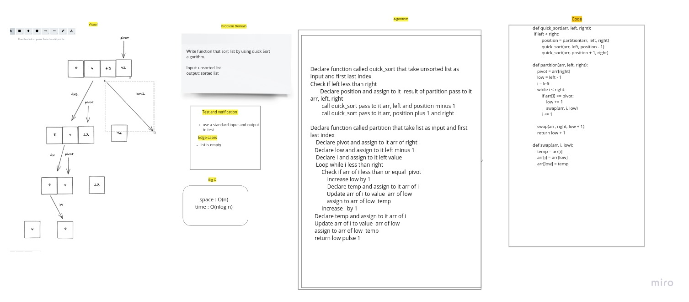

# Challenge Summary

write a function take a unsorted list and return sorted list by using quick sort algorithm

## Whiteboard Process

## Approach & Efficiency

space : O(n)
time : O(nlogn)

## Solution

provide pivote value divide the list to left list and right list the element that less than pivote in left and the value greater than pivote on left and after that sort it and marge it again .
