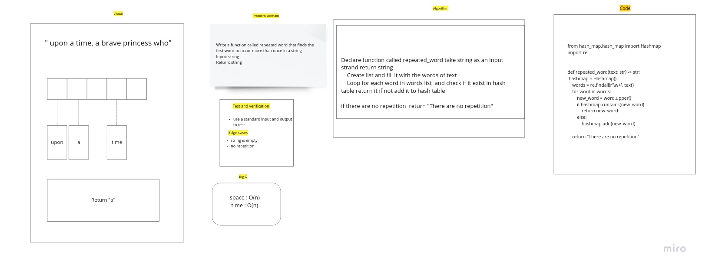

# Challenge Summary

Write a function called repeated word that finds the first word to occur more than once in a string
Input: string
Return: string

## Whiteboard Process

## Approach & Efficiency

space : O(n)
time : O(n)

## Solution

Create list and fill it with the words of text
Loop for each word in words list and check if it exist in hash table return it if not add it to hash table

if there are no repetition return "There are no repetition"
