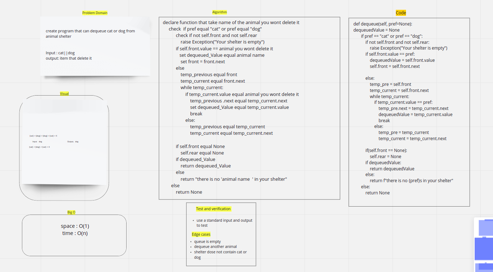

# Challenge Summary

by Animal_shelter you can enqueue and dequeue cats and dogs only from preorty queue

## Whiteboard Process

## codechallenge12

## Approach & Efficiency

enqueue:
space: O(1)
time: O(1)

dequeue:
space: O(1)
time: O(n)

## Solution

when enqueue item check if item equal cat or dog add it to queue
when dequeue check if item equal cat or dog delete first item equal the item you wont delete it from queue
