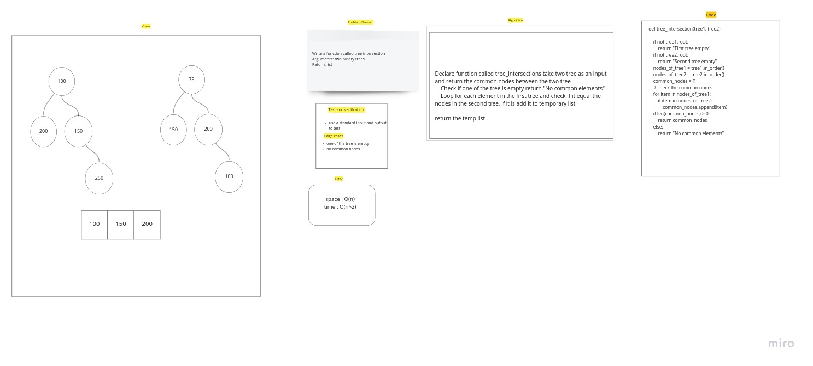

# Challenge Summary

Write a function called tree intersection
Input: two binary trees
Return: array

## Whiteboard Process

## Approach & Efficiency

space : O(n)
time : O(n^2)

## Solution

    Check if one of the tree is empty return "No common elements"
    Loop for each element in the first tree and check if it equal the nodes in the second tree, if it is add it to temporary list
